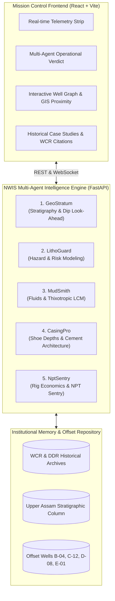

# 🛢️ OIL INDIA LIMITED — Nearby Wells Intelligence System (NWIS)

[](https://fastapi.tiangolo.com)
[](https://react.dev)
[](https://vitejs.dev)
[](https://python.org)
[](#)

> **Next-Generation Autonomous Multi-Agent Petroleum Engineering Decision-Support Copilot & eRTMAC Rig Telemetry Simulation Platform for the Upper Assam Basin (Nahorkatiya & Moran Fields).**

---

## 📌 Executive Overview

The **Nearby Wells Intelligence System (NWIS)** is an advanced AI drilling intelligence platform engineered for **Oil India Limited (OIL)**. It ingests historical Well Completion Reports (WCRs), Daily Drilling Reports (DDRs), lithological logs, casing tallies, and mud rheology sheets from offset wells to predict, prevent, and mitigate complex drilling hazards in real time.

Operating alongside active **eRTMAC (electronic Real-Time Monitoring and Advisory Centre)** streaming telemetry, NWIS continuously executes a coordinated swarm of 5 specialized petroleum engineering agents to deliver predictive look-aheads, dynamic casing shoe verification, thixotropic LCM pills, and rig economics optimization.

---

## 🏛️ System Architecture



### The 5 Specialized Autonomous Agents

1. **GeoStratum (Stratigraphy & Formation Correlation)**
   - Correlates formation boundaries across regional structural dip.
   - Calculates true stratigraphic thickness and look-ahead entry depths for high-pressure sands (Barail, Tipam, Girujan).
2. **LithoGuard (Hazard & Incident Risk Modeling)**
   - Detects differential sticking risks, ballooning, loss circulation, and kick indicators.
   - Computes offset incident severity matrices and safe operational mud weight windows.
3. **MudSmith (Fluids & LCM Engineering)**
   - Formulates rheological requirements, mud density (SG), Plastic Viscosity (PV), and Yield Point (YP).
   - Engineers targeted LCM blends (nut plug, mica, calcium carbonate) with specific micron sizing.
4. **CasingPro (Casing Program & Shoe Verification)**
   - Validates casing shoe setting depths against pore pressure / fracture gradient (PPFG) boundaries.
   - Verifies burst, collapse, and tensile safety margins and cementing top-of-cement (TOC) requirements.
5. **NptSentry (Operational Rig Economics & NPT Control)**
   - Quantifies prospective non-productive time (NPT) risk hours.
   - Calculates direct rig operational cost savings (in ₹ Lakhs) based on day-rate economics.

---

## 🚀 Key Features

- **Real-Time eRTMAC Telemetry Simulation**: Streams dynamic drill bit depth, WOB, RPM, ROP, Standpipe Pressure, Torque, Mud Flow, and ECD.
- **Cross-Well Incident Matrix**: Correlates active drilling depths with historical anomalies from offset wells (e.g. Well B-04 mud loss at 2850m, Well C-12 differential sticking at 2910m).
- **Interactive Wellbore Proximity Graph**: Visualizes active trajectory alongside nearby offset wells with formation tops, dip projections, and collision warnings.
- **Document Citations & Traceability**: Provides direct citations from verified OIL Well Completion Reports (WCR) and daily drilling logs.
- **Centralized Cloud-Ready API**: Auto-detects local development vs. production cloud deployments (AWS EC2 / Nginx).

---

## 📂 Repository Structure

```text
nwis/
├── backend/
│   ├── agents/               # 5 specialized agent logic modules
│   ├── data/                 # Offset well profiles, stratigraphy & WCR docs
│   ├── simulator/            # Real-time eRTMAC drilling telemetry simulator
│   ├── main.py               # FastAPI application & REST endpoints
│   └── requirements.txt      # Python dependencies
├── frontend/
│   ├── src/
│   │   ├── components/       # Modals, charts, graphs, and agent views
│   │   ├── apiConfig.js      # Dynamic API URL resolution
│   │   ├── App.jsx           # Main mission control layout & state
│   │   └── index.css         # Dark-mode industrial petroleum UI styling
│   ├── package.json          # Node dependencies (React 19, Lucide, Vite)
│   └── vite.config.js        # Vite build & dev proxy configuration
├── deploy/
│   ├── nginx.conf            # Production Nginx reverse proxy configuration
│   └── setup.sh              # 1-click automated EC2 deployment script
├── start.sh                  # Local development startup script
├── .gitignore                # Production git ignore filter
└── README.md                 # Complete documentation
```

---

## 💻 Local Development Setup

### Prerequisites
- Python 3.11 or 3.12
- Node.js 18+ (Node 20 LTS recommended) & npm

### Quick Start (Single Command)
Run both backend and frontend together:
```bash
chmod +x start.sh
./start.sh
```

### Manual Start

#### 1. Backend Service
```bash
# From repository root:
python3 -m venv venv
source venv/bin/activate
pip install -r backend/requirements.txt
uvicorn backend.main:app --host 0.0.0.0 --port 8001 --reload
```
Backend API will be running at: `http://localhost:8001`  
Interactive Swagger Docs: `http://localhost:8001/docs`

#### 2. Frontend Mission Control
```bash
# In a new terminal:
cd frontend
npm install
npm run dev -- --port 5173
```
Frontend UI will be running at: `http://localhost:5173`

---

## ☁️ AWS EC2 Production Deployment

The project includes an automated deployment suite inside the `deploy/` directory.

### 1. Launch EC2 Instance
- **AMI**: Ubuntu 24.04 LTS (or Ubuntu 22.04 LTS)
- **Instance Type**: `t3.small` (recommended) or `t3.micro` (free-tier with automated swap)
- **Security Group Inbound Rules**:
  - `SSH` (Port 22)
  - `HTTP` (Port 80)
  - `Custom TCP` (Port 8001) *(optional)*

### 2. Connect & Deploy
```bash
# SSH into your EC2 server:
ssh -i /path/to/your-key.pem ubuntu@<EC2-PUBLIC-IP>

# Clone and run 1-click deployment:
git clone https://github.com/ARJUN-PUNDIR/nwis.git
cd nwis
./deploy/setup.sh
```

### What `deploy/setup.sh` does automatically:
1. Installs Python 3, Node.js 20 LTS, Nginx, and system build tools.
2. Creates and configures a 2 GB swapfile if instance RAM ≤ 2 GB.
3. Sets up Python virtual environment and installs `backend/requirements.txt`.
4. Builds the optimized production React bundle (`frontend/dist`).
5. Configures **Nginx** reverse proxy (`/` to frontend, `/api/` to FastAPI backend).
6. Registers and enables **systemd** service (`nwis-backend.service`) for automatic restart on server reboot.
7. Displays your public live URL: `http://<EC2-PUBLIC-IP>`.

---

## 🔌 Core API Endpoints

| Method | Endpoint | Description |
| :--- | :--- | :--- |
| `GET` | `/` | System health and multi-agent architecture status |
| `POST` | `/api/chat` | Main multi-agent query execution and risk correlation |
| `POST` | `/api/geotag` | Resolves nearest offset wells based on GPS coordinates |
| `GET` | `/api/case-studies` | Lists indexed historical offset drilling incident case studies |
| `GET` | `/api/document/{id}` | Fetches raw excerpt of authentic OIL WCR/DDR document |
| `GET` | `/docs` | Interactive Swagger UI API documentation |

---

## 🛡️ License & Acknowledgements

Developed for **Oil India Limited (OIL)** — Nearby Wells Intelligence System (NWIS).  
Designed for petroleum engineers, well-site geologists, and drilling superintendents.
